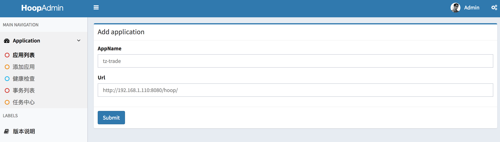
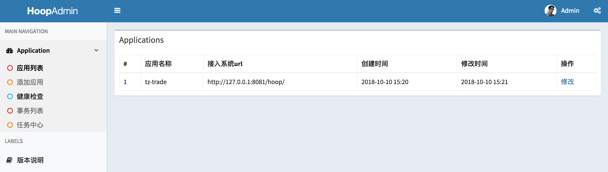
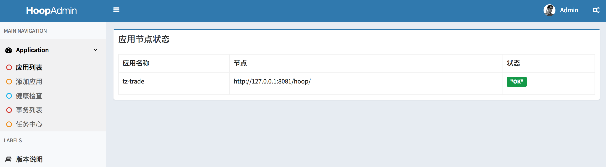
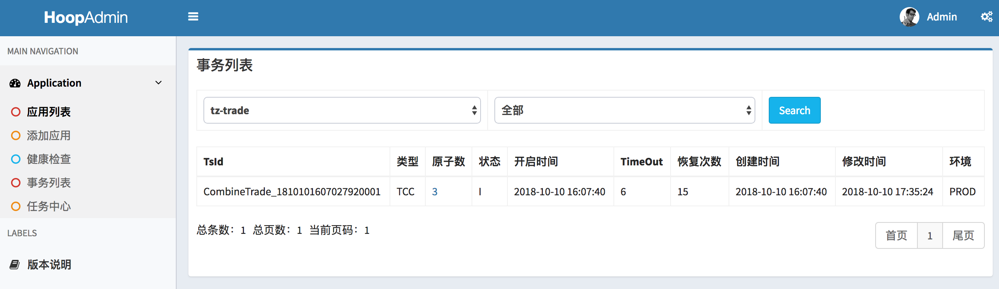
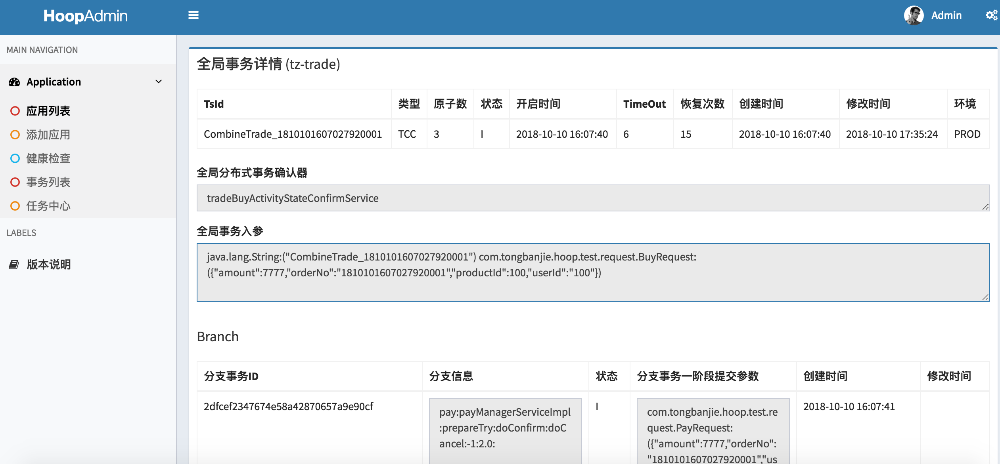

## Hoop:TCC分布式事务的一种实现。
   
Try: 尝试执行业务「幂等性」

    完成所有业务检查（一致性）
    预留必须业务资源（准隔离性）

Confirm: 确认执行业务「幂等性」 

    真正执行业务
    不作任何业务检查
    只使用Try阶段预留的业务资源
    Confirm操作满足幂等性

Cancel: 取消执行业务「幂等性」

    释放Try阶段预留的业务资源
    Cancel操作满足幂等性

当Confirm|Cancel一直不成功怎么处理？ 重试？ 重试还一直不成功怎么办？
一般代码没出现bug的情况，二阶段执行一阶段预留的资源都会成功，如果出现业务代码级别的bug，那只能人工介入了。
   
## 一、简介

### 1.1 特性

 - 1、简单，方便：分支事务提供原子TCC服务，全局事务组合管理分支事务
 - 2、补偿任务：异常情况的补偿，多台机器补偿，并发控制处理，高效快速
 - 3、严谨，可靠：各种断电情况下的严格测试，具有金融产品属性

### 1.2 环境
- JDK：1.6+
- Maven：3+

### 1.3 Core
###名词解释：
- 1、global_transaction:分布式全局事务，代表着一个分布式事务的生命周期
- 2、branch_transaction:分布式分支事务，提供try confirm cancal 方法
- 3、TsId：事务Id 【客户端自身保证唯一性】，每一个全局事务都需要一个指定的业务TsId @see com.tongbanjie.hoop.api.utils.TsIdBuilder

####hoop框架核心思想
- 0.一个TsId只能开启一次分布式全局事务
- 1、hoop认为全局事务流程中没有任何异常，提交全局事务
- 2、hoop会回滚RollbackException，其他异常一律挂起 直到事务钩子确认事务状态后推进事务
- 3、hoop接受try正常执行完毕，在更新全局事务记录为提交中|回滚中 出现异常（包括不限于应用Crash，db异常等）
   如果全局事务没有设置事务钩子，那么等应用恢复正常后，框架默认会回滚调try阶段提交的分支事务;
   如果全局事务设置了事务钩子，那么等应用恢复正常后，框架根据全局事务状态器返回的状态码来决定事务的提交|回滚;
   **[hoop推荐每个全局事务都配备事务钩子]**

## 二、快速入门
### 2.1 初始化 
 1、接入方执行hoop.sql
 
### 2.1 项目集成
#### 步骤一：maven依赖

    <dependency>
          <groupId>com.tongbanjie.hoop</groupId>
          <artifactId>hoop-core</artifactId>
          <version>1.0</version>
    </dependency>

#### 步骤二: spring配置 servlet配置
        <!-- 目前只支持mysql引擎存储事务单据  需要额外配置jdbcTemplate 且配置注解事务生效 -->
        <aop:aspectj-autoproxy proxy-target-class="true"/>
        <hoop:bootstrap storeModel="mysql"/>
        <hoop:config appName="hoop_sample"
                     maxRecoverCount="1000"
                     recoverTimeInterval="3"
                     beforTime="3"/>

        <!--web.xml下面配置以下servlet springboot应用的话自己注入-->
          <servlet>
            <servlet-name>hoop</servlet-name>
            <servlet-class>com.tongbanjie.hoop.core.servlet.HoopServlet</servlet-class>
            <load-on-startup>2</load-on-startup>
          </servlet>
        
          <servlet-mapping>
            <servlet-name>hoop</servlet-name>
            <url-pattern>/hoop/</url-pattern>
          </servlet-mapping>
#### 步骤三：demo
      注解tcc模式：com.tongbanjie.hoop.tcc.annotation.TccMain
      注解补偿事务模式：com.tongbanjie.hoop.compensate.CompensateMain
      事务钩子：com.tongbanjie.hoop.tcc.confirm.BuyTicketsHook 主流程没有走到终态的 事务钩子负责推进事务

## 三、管控台

### 3.1 环境准备 mysql linux 
 1、管控台执行 hoop-admin.sql
 2、jdbc.properties 修改
    
 
### 3.1 管控台页面
####  接入新应用

####  应用节点查询

####  节点应用状态查看

####  目标应用待恢复的事务日志列表查看

####  目标应用事务详情

